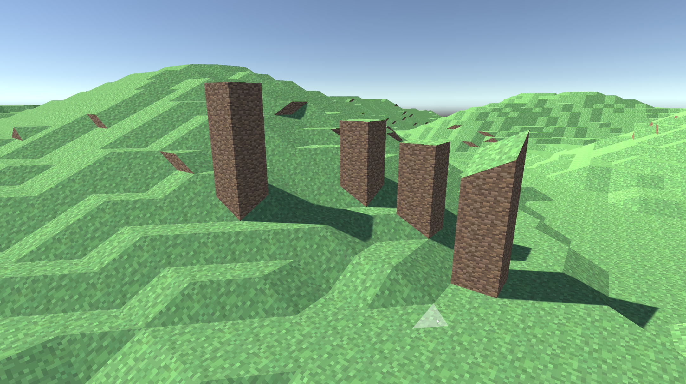
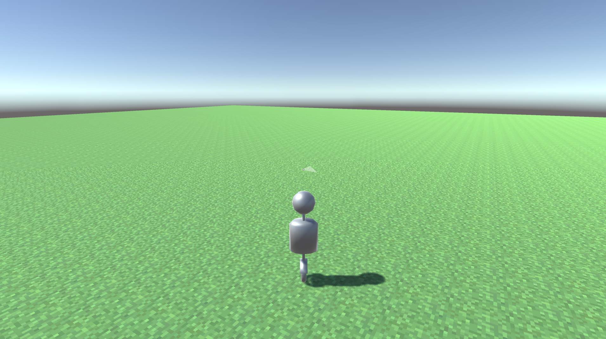

# Unity Procedurally Generated World
A game made in unity with a procedurally generated world. It is infinitely explorable and generates the geometry and meshes around the player when you move close the area where they'd be needed.

In future I'd like it the game to be editable from directly inside the engine, the rudementary tools to do that are partially implemented already.
